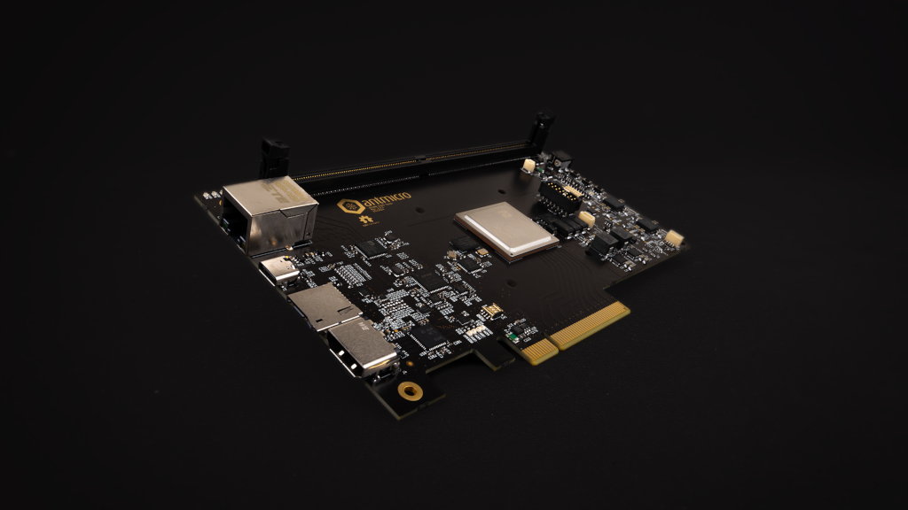

# Data Center RDIMM DDR5 Tester

Copyright (c) 2021-2024 [Antmicro](https://antmicro.com)

## Overview

This project contains open hardware KiCad design files for an experimental, FPGA-based platform for interfacing with RDIMM DDR5 RAM modules.
The latest design revision (Rev.2.x) features an AMD Artix UltraScale Plus FPGA.
The design files are now being verified with a small series of prototypes.
The [previous revision](https://github.com/antmicro/ddr5-tester/releases/tag/rev.1.0.1-production) (Rev.1.x) was built around an AMD (Xilinx) Kintex-7 FPGA and the design files were verified with prototypes.
This hardware DDR5 testing platform integrates with the open source [Rowhammer Tester](https://github.com/antmicro/rowhammer-tester) project.

## Project structure

The main repository directory contains KiCad PCB project files, a LICENSE and README.
The remaining files are stored in the following directories:

* `doc` - contains PDF schematics
* `assets` - contains visual assets for showcasing this design on [Open Hardware Portal](https://openhardware.antmicro.com/boards/data-center-rdimm-ddr5-tester/?view=top-ortho&tab=features).

## Key features

* Artix Ultrascale plus FPGA (AU25P)
* RDIMM DDR5 memory slot
* PCIe 8x Edge connector
* HDMI output connector
* Ethernet RJ45 connector with 1GbE transceiver
* USB-C debug connector with FT4232HQ FTDI USB controller
* JTAG connector
* microSD card slot
* 16 MBytes S25FL128S QSPI FLASH memory
* IS66WVH16M8DBLL HyperRAM
* External 7-15V DC power input

## License

This project is published under the [Apache-2.0](LICENSE) license.
